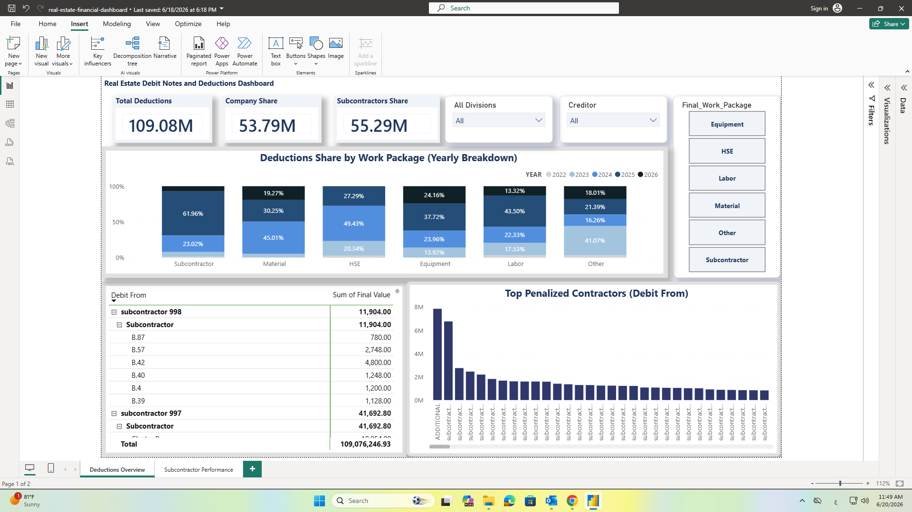

# Real Estate Debit Notes and Deductions Dashboard

## Project Overview
An interactive Power BI dashboard designed for Senior Cost Control and Operations Management to monitor financial metrics, track subcontractor deductions, and optimize debit note processing. This project solves complex structural data challenges by transforming aggregated site records into granular, audit-ready financial insights, ensuring total cash flow protection and strict auditing control.

**##Confidentiality Note: To safeguard proprietary company data and adhere to strict non-disclosure policies, all financial figures, subcontractor names, material descriptions, and specific historical dates within this repository and dashboard previews have been completely anonymized, randomized, or synthesized. The workflows and data structures represent actual engineering logic, but do not mirror real-time or active commercial records.**

## Dashboard Preview

### 1. Debit Notes & Deductions Overview

### 2. Subcontractor Performance Tracking

## Core Features and Visual Hierarchy
* **Financial KPIs:** Real-time tracking of total deductions, company share recoveries, and subcontractor liabilities.
* **Work Package Breakdown:** High-contrast visualization isolating operational claims by specific sectors including HSE, Equipment, Materials, and Labor.
* **Performance Ledger:** A granular data grid designed for financial reconciliation, mapping balances directly to specific subcontracting entities.
* **Operational Slicers:** Dynamic filtering by divisions and creditor types to isolate billing workflows instantly.

## Advanced Data Infrastructure (Power Query Pipeline)
To build a reliable reporting layer, an advanced ETL pipeline was engineered entirely within Power Query (M Language) to resolve complex many-to-many transaction relationships without altering the source system:
* **Dynamic Property & Villa Unwrapping:** Programmatically parsed and tokenized multi-villa compound strings (e.g., separating compressed site logs) to allocate flat-rate deduction expenses evenly across individual structural units.
* **Multi-Division Task Splitting:** Consolidated and cross-expanded multi-tier project divisions (`DEVSION 1-8`), dynamically weight-averaging values based on active task counts to prevent double-counting.
* **Automated Accountability Routing:** Implemented conditional logical layers to dynamically audit and classify whether a debit note represents a direct recovery for the **Company Share** or a back-to-back liability transfer to another **Creditor Subcontractor**.
* **Normalization & Schema Cleanliness:** Streamlined data quality by unpivoting complex matrices, stripping administrative metadata, applying strict type casting, and standardizing directional values using absolute mathematical transformations (`Number.Abs`).

## Technical Stack
* **Data Engineering & ETL:** Power Query (Advanced M-Language Pipeline)
* **Analytics and Visualization:** Power BI Desktop
* **Data Architecture:** Star Schema Modeling, Row-Level Consistency, and Negative Space Optimization

## Deployment and Usage
1. Review the advanced M-code transformation logic inside the Power Query editor.
2. Open the `.pbix` file using Power BI Desktop to explore the full interactive layouts and drill-down functionality.
