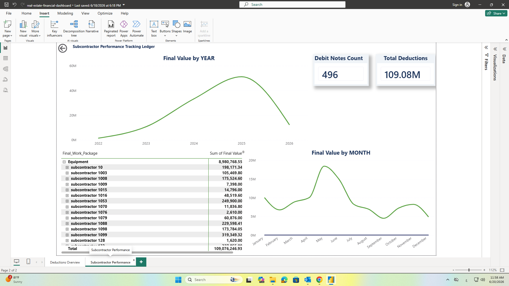

#  Real Estate Debit Notes and Deductions Dashboard

##  Project Overview
An interactive Power BI dashboard designed for Senior DC Cost Control and Operations Management to monitor financial metrics, track subcontractor deductions, and optimize debit note processing. This project focuses on protecting cash flow and strengthening auditing standards by bridging the gap between site logs and financial control records.

##  Dashboard Preview

###  1. Debit Notes & Deductions Overview

###  2. Subcontractor Performance Tracking

##  Core Features and Visual Hierarchy
* **Financial KPIs:** Real-time tracking of total deductions, company share balances, and subcontractor liabilities.
* **Work Package Breakdown:** High-contrast visualization isolating operational claims by specific sectors including HSE, Equipment, and Labor.
* **Performance Ledger:** A granular data grid designed for financial reconciliation, mapping balances directly to specific subcontracting entities.
* **Operational Slicers:** Dynamic filtering by divisions and creditor types to isolate billing workflows instantly.

##  Data Infrastructure and Pipeline
To build a reliable reporting layer, structural SQL pipelines were implemented to pull, clean, and consolidate transactional records. The logic handles:
*  Merging independent material orders with site penalty logs and cost control sheets.
*  Aggregate functions to compute actualized financial impacts and aging delays.
*  Data quality filtering to standardize naming conventions and handle pending transaction flags.

##  Technical Stack
* **Data Engineering:** SQL / Power Query
* **Analytics and Visualization:** Power BI Desktop
* **Architecture:** Star Schema, Row-Level Consistency, and Negative Space Optimization

##  Deployment and Usage
1. Review the data architecture and logic inside the query file.
2. Open the `.pbix` file using Power BI Desktop to explore the full interactive layouts and drill-down functionality.
